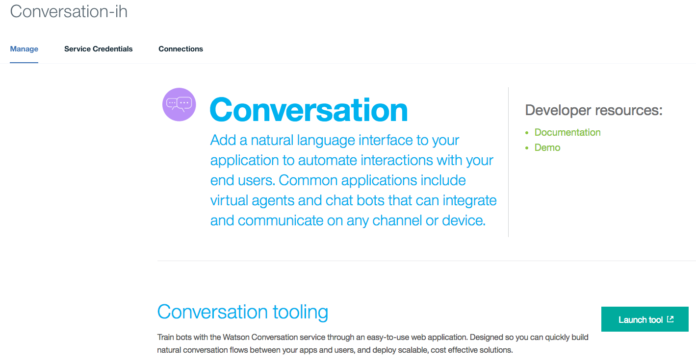
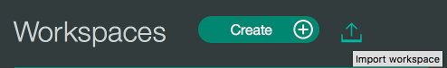
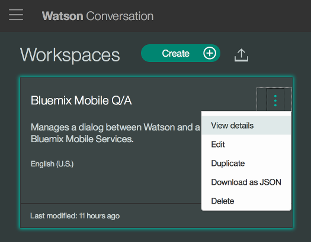
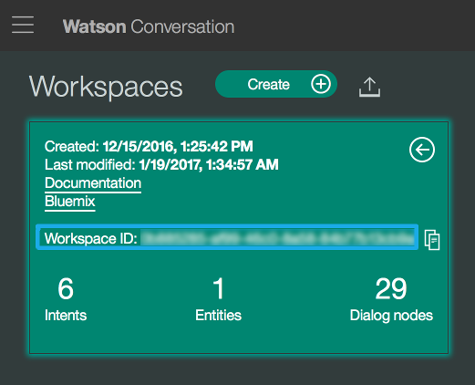
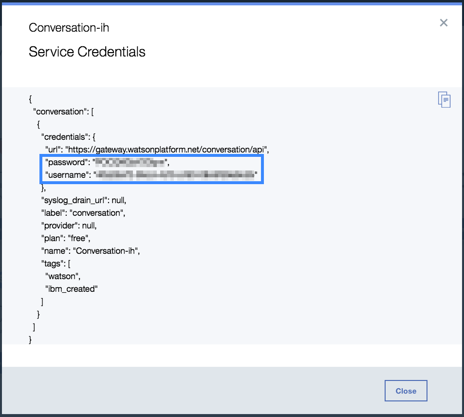
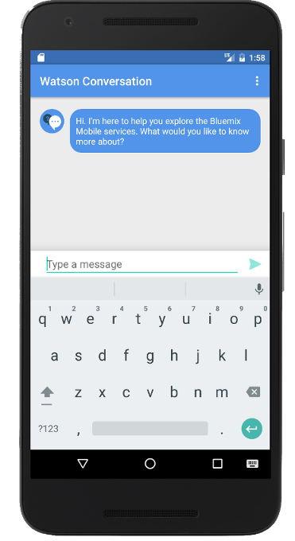
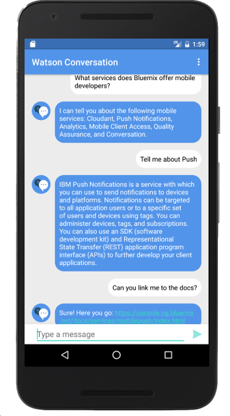

## Conversation
Bluemix Mobile Starter for Conversation in Android

[](https://bluemix.net)
[](https://developer.android.com/index.html)

### Table of Contents
* [Summary](#summary)
* [Requirements](#requirements)
* [Conversation Configuration](#conversation)
* [Application Configuration](#configuration)
* [Run](#run)
* [License](#license)

### Summary
This Bluemix Mobile Starter will showcase the Conversation service from Watson and give you integration points for each of the Bluemix Mobile services.

### Requirements
* [Android Studio](https://developer.android.com/studio/index.html)
* A [Conversation](https://console.ng.bluemix.net/catalog/services/conversation/) service instance obtained from the [Bluemix Catalog](https://console.ng.bluemix.net/catalog/)

### Conversation Configuration
You will need to create or upload a conversation file to your Watson Conversation service on Bluemix in order to allow interaction with the service.

In the dashboard of your Conversation service on Bluemix run the Conversation tooling dashboard by clicking the **Launch tool** button:



Now create your own Conversation Workspace or import the sample workspace named `bluemix_mobile_qa_workspace.json` we have included in this project by selecting the import button from your Workspaces screen and navigating to the provided .json:


After you have created or uploaded a Conversation Workspace you will need to get the Workspace Id. Click the **View details** list item to see the Workspace information. Save the **WorkspaceID** which we will need to include in our application configuration:



### Application Configuration
* Open the project in Android Studio and perform a Gradle Sync.
* Navigate to `res/values/watson_credentials.xml` and input your Watson Conversation **Password**,  **Username**, and the **WorkspaceID** from earlier.

```HTML
<resources>
    <string name="watson_conversation_password">xxxxxxxxxxxx</string>
    <string name="watson_conversation_username">xxxxxxxx-xxxx-xxxx-xxxx-xxxxxxxxxxxx</string>
    <string name="watson_conversation_workspace_id">xxxxxxxx-xxxx-xxxx-xxxx-xxxxxxxxxxxx</string>
</resources>
```

To obtain your Password and Username navigate to your `Service Credentials` tab in your Conversation Service Dashboard:



### Run
You can now run the application on a simulator or physical device:




The Watson Conversation service allows you to add a natural language interface to your application to automate interactions with your end users. This project shows an application of this service that allows you to have a conversation with Watson. Watson will send an initial conversation which you can then reply to and continue to interact with the service.

### License
This package contains code licensed under the Apache License, Version 2.0 (the "License"). You may obtain a copy of the License at http://www.apache.org/licenses/LICENSE-2.0 and may also view the License in the LICENSE file within this package.
